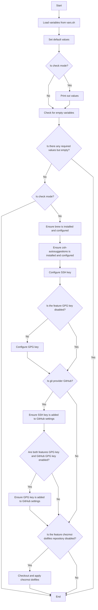

# ansidev's dotbs

## Introduction

I created this project for migrating my configurations among my devices.

At this moment, this project is built for macOS only.

## Installation

1. Download `bootstrap.sh` manually.
2. Download `vars.sh.example` manually and rename it to `vars.sh`.
3. Update `vars.sh`.
4. Check your variables.

   ```sh
   sh bootstrap.sh --check
   ```

   If the result is OK, go to the next step. Otherwise, go to the previous step.

5. Run

   ```sh
   sh bootstrap.sh
   ```

6. Restart your shell after the script is ran successfully.

## Flowchart



## Author

Le Minh Tri [@ansidev](https://ansidev.xyz/about).

## License

This source code is released under the [MIT License](/LICENSE).
